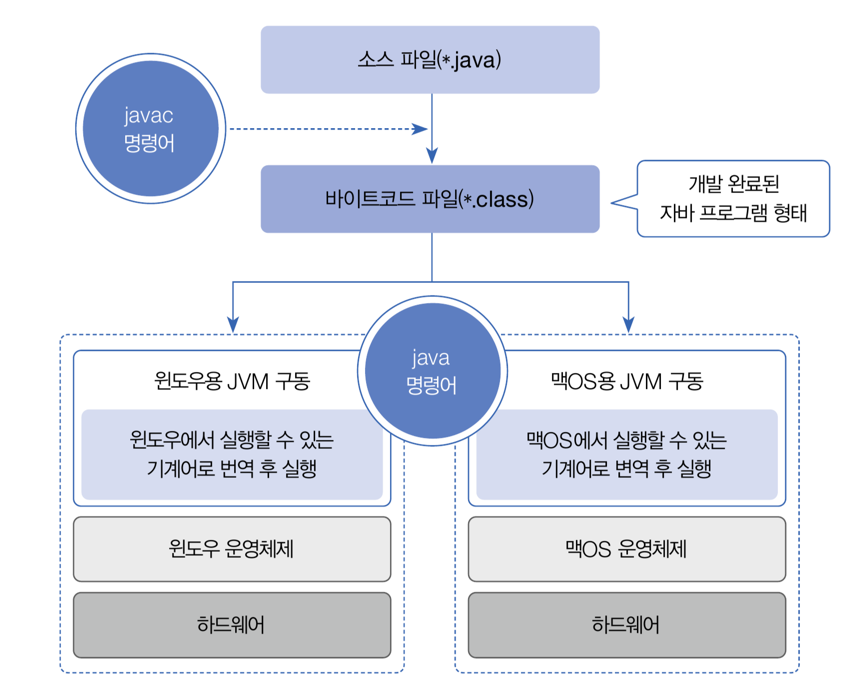
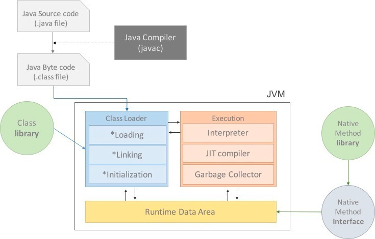

## ch1. 자바 시작하기

## 자바 소스 파일(.java)을 JVM으로 실행하는 과정

  출처 : 이것이 자바다

> 자바 소스 파일 작성 -> 컴파일러로 바이트코드 파일 생성 -> JVM을 통해 기계어로 번역 후 실행

## JVM

- JVM은 Java Virtual Machine 의 줄임말로, 컴파일된 자바 바이트 코드를 운영체제에 관계 없이 실행할 수 있게 해주는 역할을 한다.

> 다른 언어처럼 컴파일러를 사용해서 물리머신에 맞는 기계어 코드를 바로 생성하면 되는데 왜 굳이 바이트 코드 / 가상머신이라는 계층을 추가하였을까?
- 하드웨어 마다 구조가 다르기 때문에 컴파일을 각 구조에 맞게 해줘야하는 문제가 발생
- 한번 컴파일한 것은, 어느 하드웨어 구조에서든지 읽고 동작할 수 있다는 장점
- JVM에 자바의 주요 철학인 추상화를 적용

### 구성

- 자바 인터프리터(interpreter)
- 클래스 로더(class loader)
- JIT 컴파일러(Just-In Time compiler)
- 가비지 컬렉터(garbage collector)

### JIT 컴파일러

- Just-In-Time compiler(JIT)란 프로그램을 실제 실행하는 시점(동적 컴파일)에 기계어로 번역하는 컴파일 기법
- 인터프리터 방식과 컴파일 방식을 혼합한 방식
- 실행시점에 인터프리터 방식으로 기계어 코드를 생성하면서 그 코드를 캐싱하여 같은 함수가 여러 번 호출될 때 매번 생성하는 것을 방지

더 자세한 설명 : https://kotlinworld.com/307

## JDK와 JRE 차이

- JRE : JRE 는 JVM의 구현체이다. JVM, Java 클래스 라이브러리, java명령 및 기타 인프라를 포함하여 컴파일 된 JAVA프로그램을 실행하는데 필요한 모든 것을 포함한 패키지

   
- JDK : JRE + 개발을 위한 도구